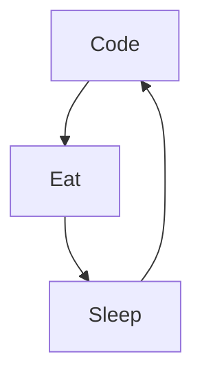

# Yves G.
I'm Yves, Front-end ReactJS developper, from France and living in Montpellier 🌴. 

<!--
**Webnume/Webnume**  is a ✨ _special_ ✨ repository because its `README.md` (this file) appears on GitHub profile.
-->
Actually:

- 🔭 I’m currently working on ReactJS every day ...
- 🌱 I’m currently learning amazing things ...
- 👯 I help people to give life to their projects ...
- ⚡ Fun fact : I'am Music maker, Nature & Yoga lover ...
- 📫 How to reach me: LinkedIn or email

## My portfolio

 <strong>
    Check my work as a React Programmer
  </strong>
  

    Contact me for building amazing projects
  

  
 

### Connect with me:

&nbsp;&nbsp;

### Languages and Tools:

[][website]

[][website]
[][website]
[][website]
[][website]
[][website]
[][website]
[][website]

 
 

### My daily routine :

### 🔥 Recent GitHub Activity
<!--START_SECTION:activity-->

<!--END_SECTION:activity-->

### ⭐ GitHub Stats

[website]: https://webnumerik.fr